#  Cloud Resume Challenge

**This project is my implementation of the Cloud Resume Challenge — a multi-cloud, infrastructure-as-code driven resume website that demonstrates real-world skills in AWS, GCP, Azure, CI/CD automation, serverless architecture, and DevOps tooling. It combines a modern web frontend with cloud-native services, GitHub Actions pipelines, OIDC-based secure deployments, and fully automated IaC workflows, serving as both a technical portfolio piece and a comprehensive showcase of end-to-end cloud engineering.**

---

## Resume Portal Links

|**Cloud Provider**| **URL**                  |
|--                |--                        |
|AWS               |https://resume.subhamay.us|
|GCP               |https://resume.subhamay.com|
|Azure             |https://www.subhamay-resume-azure.space|

## Infrastructure Repo

- AWS: [infra/aws](infra/aws)
- GCP: [infra/gcp](infra/gcp)
- Azure: [infra/azure](infra/azure)

## Resume portal repo 
- Frontend: [frontend](frontend)


## 1. **Tools, Services & Technologies Used**

This project implements the **Cloud Resume Challenge** using a modern **multi-cloud** and **IaC-driven** architecture. The design integrates cloud services, CI/CD automation, and a fully portable development environment for consistent workflows.

### **Cloud Services**

* **AWS:** S3 (static hosting), Route 53 (DNS), IAM, API Gateway, Lambda, DynamoDB
* **GCP:** Google Cloud Storage
* **Azure:** Azure Blob Storage

### **DevOps & Automation**

* **GitHub:** Source control, GitHub Actions for CI/CD, and **OIDC** for secure, secretless authentication to cloud providers
* **HCP Terraform:** Centralized remote state management

### **Infrastructure as Code**

* **Terraform** (primary IaC)
* **Terragrunt** (multi-environment orchestration)
* **Ansible** and **AWS CloudFormation** for additional automation needs

### **Application Stack**

* **HTML5**, **React**, **Node.js** powering the resume portal UI and workflows

### **DevContainer Tools**

* **IaC:** terraform, terragrunt, terraform-docs, tfupdate, hcledit
* **Security:** tflint, tfsec, terrascan, trivy, infracost
* **CLIs:** awscli, gcloud, azurecli, nodejs, http-server

This architecture demonstrates multi-cloud design, modern DevOps practices, and a fully automated IaC workflow — providing a scalable, secure, and reproducible environment for the Cloud Resume Challenge.

---
### The following Mermaid mindmap shows the services used in the project

```mermaid
mindmap
  root)Cloud Resume Challenge(
    🟧 AWS
      S3
      Route53(DNS Route53)
      CloudFront
      IAM(Identity and Access)
      API Gateway
      Lambda
      DynamoDB
      ACM (AWS Certificate Manager)
    🔵 GCP
      Cloud Storage
      Compute Engine
      Cloud DNS
    🟦 Azure
      Blog Storage
      DNS
      Front Door (CDN)
    Infrastructure As Code
      Terraform
      Ansible
      CloudFormation(AWS CloudFormation)
      🐙 GitHub
        Repository
        GitHubActions(GitHub Actions CI/CD)
        OIDC(Workload Identity Federation)
        Codespace (developement platform)
    Resume Portal
      HTML5
      JavaScript
      ViteJS
      Node.js
```



## 2. OIDC Architecture (GitHub → AWS / GCP / Azure)
GitHub Actions uses OpenID Connect (OIDC) to authenticate to AWS, GCP, and Azure without storing long-lived cloud credentials in GitHub.
At runtime, the workflow requests a short-lived OIDC token from GitHub, which each cloud provider validates through a pre-configured trust relationship (AWS OIDC IdP + IAM role, GCP Workload Identity Pool + Service Account, Azure Federated Credentials + Service Principal).
The workflow then receives temporary credentials scoped to that identity and uses them to deploy infrastructure and update the Cloud Resume resources across all three clouds.


## 3. Repository Overview

- **Purpose**
  - Centralized infrastructure IaC for all cloud providers (AWS, GCP, Azure)
  - Managed via Terraform with HashiCorp Cloud (Terraform Cloud)
- **Repo Structure (infra)**
  - `.devcontainer/` – Dev container configuration for infra development
  - `aws/` – AWS-specific Terraform modules and stacks
  - `gcp/` – GCP-specific Terraform modules and stacks
  - `azure/` – Azure-specific Terraform modules and stacks
  - `frontend/` – Conatins the HTML codes for the Resume

## 4. Prerequisites

- **Accounts/Access**
  - GitHub account with access to this monorepo
  - HashiCorp Cloud (Terraform Cloud) account
  - AWS, GCP, and Azure accounts with sufficient permissions (per-provider docs in subfolders)
<!-- - **Local Tooling (if not using devcontainer)**
  - `git`
  - `terraform` (version X.Y.Z)
  - `tfc-agent` *(if applicable)*
  - `docker` / `docker desktop` (for devcontainer) -->

## 5. HashiCorp Cloud / Terraform Cloud Setup

### 5.1 Create Terraform Cloud Organization & Projects

- Steps:
  - Create **organization**
    

  - Create **project**
    
  

  - Set **execution mode** to `Local`
    

  - Create **API Token** to be used in GitHub Codespace and GitHub Action

    

    
### 5.2 Workspaces & Remote Backend Configuration

- Standard naming conventions for workspaces
```
cloud-resume-challenge-<cloud service provider>
```
  - Created **workspaces** per cloud environment:
    - `cloud-resume-challenge-aws`
    - `cloud-resume-challenge-gcp`
    - `cloud-resume-challengeazure`
    

- Backend block structure (example):
  - Organization name
  - Workspace name
  ```hcl
  terraform { 
    cloud { 
      
      organization = "subhamay-bhattacharyya-crc" 

      workspaces { 
        name = "cloud-resume-challenge-aws" 
      } 
    } 
  }
  ```
- Reference to per-provider backend examples:
  - AWS: [`aws/tf/backend.tf`](./aws/tf/bckend.tf) 
  - GCP: [`gcp/tf/backend.tf`](./gcp/tf/backend.tf)
  - Azure: [`azure/tf/backend.tf`](./azure/tf/backend.tf)

### 5.3 Terraform Cloud API Tokens

- **User API Token** vs **Team/Org Token**
- Where tokens are used:
  - Devcontainer integration
  - GitHub Actions CI/CD
- Token storage locations (never commit to git):
  - GitHub Secrets (e.g. `TFC_TOKEN`)
  - Devcontainer env variables / `.env` (not committed)
  - Local OS keychain *(optional)*

## 6. DevContainer Setup 

### 6.1 DevContainer Overview

- Location: `.devcontainer/`
- Base image & tools:
  ## Tool Versions
  | Tool            | Version   |
  |-----------------|-----------|
  | terraform       | 1.14.0    |
  | awscli          | 2.15.0    |
  | ansible         | latest    |
  | terragrunt      | v0.57.4   |
  | terrascan       | 1.18.4    |
  | tflint          | 0.50.3    |
  | tfsec           | 1.28.5    |
  | trivy           | 0.51.1    |
  | infracost       | 0.10.30   |
  | tfupdate        | 0.8.1     |
  | hcledit         | 0.2.5     |
  | nodejs          | 20        |
  | http-server     | 14.1.1    |
  | gcloud          | latest    |
  | azurecli        | latest    |


### 6.2 How to Open in DevContainer

- **Using GitHub Codespaces**: Open the repository in GitHub Codespaces, which will automatically launch the devcontainer
- **Using VS Code locally**: 
  - Install the Dev Containers extension
  - Open the repository in VS Code
  - Click "Reopen in Container" when prompted (or use Command Palette: "Dev Containers: Reopen in Container")
- **Using Docker CLI**: Navigate to the repository root and run `docker compose -f .devcontainer/docker-compose.yml up`

### 6.3 Configuring Terraform Cloud Token in DevContainer

- Using `.devcontainer/devcontainer.json` and `.env` file
- Example:
  - `TFC_TOKEN=***` in `.env` or GitHub Codespaces secrets
- Security notes:
  - Never commit `.env`
  - Use Codespaces secrets in GitHub for shared cloud dev

## 7. Secret Management

### 7.1 Secret Types

- Terraform Cloud:
  - `TFC_TOKEN`
- Cloud Providers:
  - AWS: Access keys (if used), role ARNs, account IDs
  - GCP: Service account emails, project IDs
  - Azure: Tenant ID, Subscription ID, Client ID

### 7.2 Where Secrets Live

- **GitHub Actions**
  - `TFC_TOKEN`
  - `AWS_ROLE_TO_ASSUME`, `AWS_ACCOUNT_ID`
  - `GCP_PROJECT_ID`, `GCP_WIF_POOL_ID`, etc.
  - `AZURE_TENANT_ID`, `AZURE_SUBSCRIPTION_ID`, etc.
- **Terraform Cloud Workspace Variables**
  - Per-environment variables (e.g. `TF_VAR_environment`)
  - Provider credentials (if not purely OIDC)

### 7.3 Secret Naming Conventions

- Prefix conventions:
  - `AWS_...`
  - `GCP_...`
  - `AZURE_...`
  - `TFC_...`
- Environment-specific suffixes:
  - `_DEV`, `_STG`, `_PROD`

## 8. Common Terraform Project Layout & Standards

### 8.1 Folder & Module Structure

<!-- - `environments/` (optional) – environment-level stacks -->
- `modules/` – reusable modules per cloud
- `main.tf`, `variables.tf`, `outputs.tf`, `providers.tf`

### 8.2 Code Quality & Policies

- Formatting & linting:
  - `terraform fmt`
  - `tflint`
- Security & policy:
  - `checkov` / `tfsec`
  - Sentinel / OPA policies *(if using)*

## 9. GitHub Actions / CI-CD Overview (Infra)

- High-level description:
  - Reusable workflows for `plan` / `apply`
- Triggers:
  - PR (plan)
  - Merge to main (apply)
- Common environment variables and inputs:
  - `cloud_provider` (aws/gcp/azure)
  - `environment` (dev/stg/prod)

## 10. Per-Cloud Documentation

- See:
  - [`aws/infra/README.md`](./infra/aws/README.md)
  - [`gcp/infra/README.md`](./infra/gcp/README.md)
  - [`azure/infra/README.md`](./infra/azure/README.md)