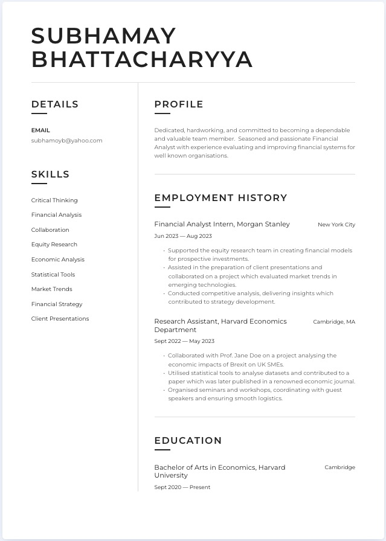
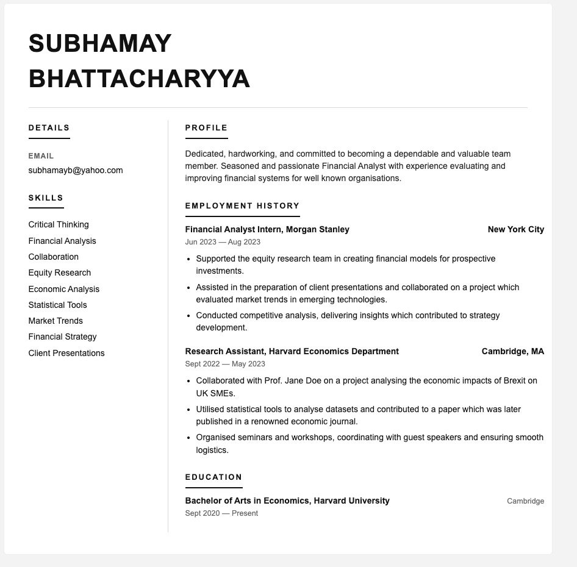

# Frontend Technical Specification

Create a static website that servves as an html resume

### Resume format consideration.

As I live in USA , the resumes in word/pdf format should exclude information such that can be discrimitive. e.g., age, sex. However in a personal website.

I am going to create the resume using plain HTML and then add style sheet to give it a professional look.

Prompt to ChatGPT 5:

```text
Convert this resume format into HTML. Please don't use a css framework.
Please use the least amount of inline css tags.
```

Image provided to LLM:




This is the [generated outout](./docs/resume-minimal-format-2025-11-23.html) that I  will refactor.

This is how the unaltered generated HTML looks like:


## HTML Adjustments

- UTF-8 will support most languages
- I will includ ethe viewport meta tag width=device-width so mobile styling scales normally
- I'll extract extract my style into its own stylesheet after I am happy with the HTML markup.
- For the HTML page I'll use 4 space tabs as I follow Python.

## Serve Static Website Locally

We need to serve our static website locally so we can start using stylesheets externally from our HTML page in a Cloud Developer Environment (CDE)

> This is not necessary for local development.

Node js and http-server will be setup via devcontainer during the codespace startup process.

## Command to start the http-server

```text
cd /workspaces/cloud-resume-challenge/frontend/public
http-server -p 8080
```


## Command to stop the http-server
```text
# Change to workspace root first
cd /workspaces/cloud-resume-challenge

# Kill the http-server process
pkill -f http-server

# Now start it correctly
http-server frontend/public -p 8080
```