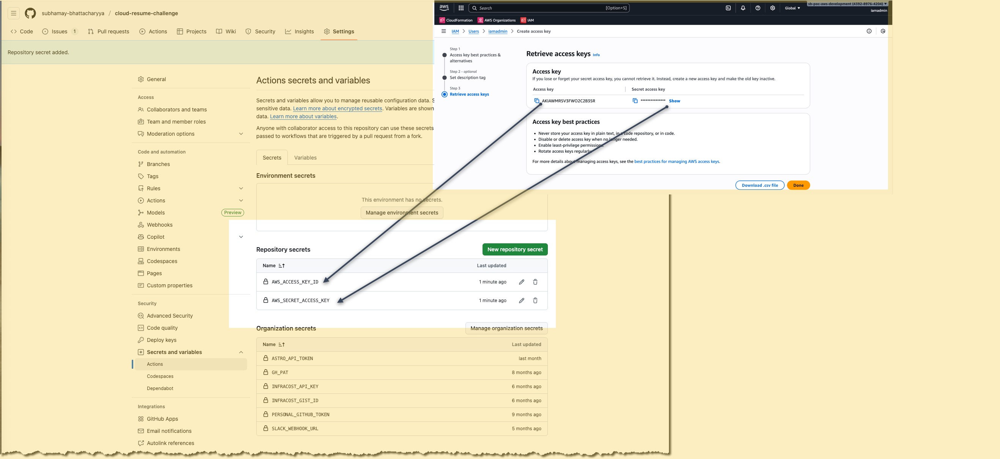

# AWS Infrastructure

## 1. Overview

- **Purpose of AWS IaC in this repo:** The AWS IaC section of this monorepo provides a standardized, automated, and fully reproducible way to provision and manage all AWS resources required for the _**Cloud Resume Challenge**_.
- High-level architecture:
  - **Accounts:** Currenly the stack will be deployed in only one environment.
  - **Core resources:** `S3`, `Route53`, `DynamoDB`, `Lambda`, `API Gateway`

## 2. Prerequisites

- AWS account
- AWS IAM user with an user with `AdministratorAccess` to setup `OIDC IAM Role` and `Identity Provider`
- Terraform Cloud organization & workspaces (see root infra README)
The image path is incorrect. It should be relative to the README.md file location. Since the README is at `/workspaces/cloud-resume-challenge/infra/aws/README.md`, the path should be:

- Create Access Key for the IAM Admin user and set the following GitHub repository secret with the the following names value:
  | Purpose               | Secret Name                 | Description                         |
  | --------------------- | --------------------------- | ----------------------------------- |
  | AWS Access Key ID     | **`AWS_ACCESS_KEY_ID`**     | The IAM user or IAM role access key |
  | AWS Secret Access Key | **`AWS_SECRET_ACCESS_KEY`** | The secret half of the key pair     |

## 3. OIDC Setup: GitHub → AWS

### 3.1 Design Overview

- **Why OIDC (no long-lived access keys):** OpenID Connect (OIDC) provides a secure, modern, and automated way for GitHub Actions to access cloud resources without storing or rotating long-lived credentials. Instead of embedding permanent AWS/GCP/Azure access keys in GitHub Secrets, workloads exchange short-lived tokens that are issued only when needed and expire automatically. This dramatically reduces the risk of credential leakage, simplifies secret management, and aligns with cloud-provider security best practices.
- **With OIDC:**
  - No hard-coded credentials — nothing stored in GitHub Secrets, nothing to rotate manually.
  - Short-lived tokens — automatically expire and minimize blast radius even if exposed.
  - Granular permissions — cloud roles (IAM/GCP SA/Azure Entra Apps) can restrict access tightly.
  - Automatic identity verification — cloud providers validate that the request is coming from your GitHub workflow.
  - Improved security posture — eliminates a major attack surface associated with leaked access keys.
  - Best practice for CI/CD — recommended by AWS, GCP, Azure, and GitHub for secure pipelines.

### 3.2 Create IAM OIDC Identity Provider

- URL & thumbprint (GitHub)
- Audience (e.g. `sts.amazonaws.com`)

### 3.3 IAM Role for GitHub Actions

- Trust policy:
  - Conditions on `sub` (repo, env)
- Recommended role naming and path conventions
- Example mapping:
  - `role/github-aws-infra-dev`
  - `role/github-aws-infra-prod`

### 3.4 GitHub Actions Configuration

- Required GitHub `permissions` block (id-token, contents)
- Example workflow snippet for `aws-actions/configure-aws-credentials`

## 4. AWS Account & Environment Layout

- Account strategy:
  - Single account w/ multiple environments
  - Or multi-account setup (Org)
- Naming conventions:
  - `aws-dev`, `aws-stg`, `aws-prod`
- Tags/labels standards:
  - `Environment`, `Owner`, `CostCenter`, `Application`

## 5. Terraform Configuration for AWS

### 5.1 Backend & Workspaces

- Reference to Terraform Cloud workspace names
- `backend.tf` example:
  - Organization
  - Workspace

### 5.2 Providers & Authentication

- `aws` provider config:
  - Region
  - Assume role via OIDC
- Multiple accounts/aliases (if applicable)

### 5.3 State & Locking

- Remote state in Terraform Cloud
- Locking behavior and concurrency

## 6. Core Modules & Stacks

- `modules/network/`
- `modules/iam/`
- `modules/eks/` *(if applicable)*
- `environments/dev/`, `environments/prod/` stacks

Include for each:
- Input variables (high-level)
- Outputs (high-level)
- Dependencies between modules

## 7. Running Terraform for AWS

### 7.1 From DevContainer / Locally

- Commands:
  - `terraform init`
  - `terraform plan`
  - `terraform apply`
- Environment selection (workspaces, variables)

### 7.2 From GitHub Actions

- Reusable workflow usage:
  - Inputs (environment, directory path)
  - Required secrets:
    - `AWS_ACCOUNT_ID_DEV`, `AWS_ROLE_ARN_DEV`, etc.

## 8. Operational Notes

- How to rotate roles/permissions
- How to add new AWS regions or accounts
- Troubleshooting common OIDC / IAM issues
