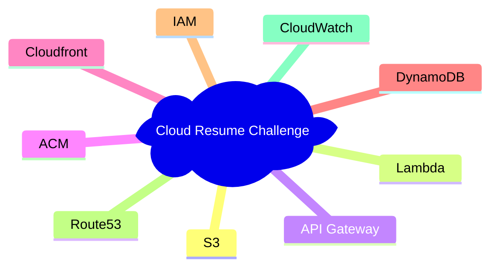

# AWS Infrastructure

## 1. Overview

This AWS Infrastructure-as-Code (IaC) section provides a complete, automated solution for deploying a static website hosting infrastructure as part of the **Cloud Resume Challenge**. The infrastructure is designed to be secure, scalable, and cost-effective using AWS managed services.

### 1.1 Services used


### 1.2 Architecture Overview

The current implementation focuses on static website hosting with the following components:

- **Primary Storage**: Amazon S3 bucket for static website hosting
- **Infrastructure Management**: Terraform for resource provisioning and state management
- **CI/CD Pipeline**: GitHub Actions with OIDC authentication for secure deployments
- **Environment Strategy**: Single AWS account with environment-based resource naming

### 1.3 Key Features

- **Security-First Approach**: OIDC integration eliminates long-lived credentials
- **Automated Deployments**: GitHub Actions workflows for validation, planning, and deployment
- **Environment Isolation**: Resource naming conventions support multiple environments (dev, test, prod)
- **State Management**: Terraform Cloud backend for secure state storage and team collaboration
- **Cost Optimization**: Random string generation for CI builds to avoid resource conflicts

### 1.4 Future Enhancements

The infrastructure is designed to be extensible for additional Cloud Resume Challenge components:
- Route53 for custom domain management
- CloudFront for global content delivery
- DynamoDB for visitor counter functionality
- Lambda functions for API endpoints
- API Gateway for RESTful services

## 2. OIDC Setup: GitHub → AWS

### 2.1 Prerequisites

Before setting up OIDC, ensure you have:
- AWS account with administrative access
- AWS CLI configured with an IAM user that has `AdministratorAccess` (only needed for initial OIDC setup)
- Terraform Cloud organization & workspaces (see root infra README)

### 2.2 Design Overview

- **Why OIDC (no long-lived access keys):** OpenID Connect (OIDC) provides a secure, modern, and automated way for GitHub Actions to access cloud resources without storing or rotating long-lived credentials. Instead of embedding permanent AWS/GCP/Azure access keys in GitHub Secrets, workloads exchange short-lived tokens that are issued only when needed and expire automatically. This dramatically reduces the risk of credential leakage, simplifies secret management, and aligns with cloud-provider security best practices.
- **With OIDC:**
  - No hard-coded credentials — nothing stored in GitHub Secrets, nothing to rotate manually.
  - Short-lived tokens — automatically expire and minimize blast radius even if exposed.
  - Granular permissions — cloud roles (IAM/GCP SA/Azure Entra Apps) can restrict access tightly.
  - Automatic identity verification — cloud providers validate that the request is coming from your GitHub workflow.
  - Improved security posture — eliminates a major attack surface associated with leaked access keys.
  - Best practice for CI/CD — recommended by AWS, GCP, Azure, and GitHub for secure pipelines.

### 2.3 Create IAM OIDC Identity Provider

The CloudFormation template creates:
- An OIDC Identity Provider for GitHub
- An IAM role that GitHub Actions can assume
- Proper trust policies with conditions for your repository

Execute the following CloudFormation template from the directory `infra/aws/cfn`:

```bash
cd /workspaces/cloud-resume-challenge/infra/aws/cfn

aws cloudformation deploy \
  --template-file github-oidc-setup.yaml \
  --stack-name github-oidc-setup \
  --capabilities CAPABILITY_NAMED_IAM \
  --parameter-overrides \
    GitHubOrg=subhamay-bhattacharyya \
    GitHubRepo=cloud-resume-challenge
```

**Note:** Replace `subhamay-bhattacharyya` with your actual GitHub organization/username and `cloud-resume-challenge` with your repository name.

### 2.4 IAM Role for GitHub Actions

- Trust policy:
  - Conditions on `sub` (repo, env)
- Recommended role naming and path conventions
- Example mapping:
  - `role/github-aws-infra-dev`
  - `role/github-aws-infra-prod`

### 2.5 GitHub Actions Configuration

- Required GitHub `permissions` block (id-token, contents)
- Example workflow snippet for `aws-actions/configure-aws-credentials`

## 3. AWS Account & Environment Layout

- Account strategy:
  - Single account w/ multiple environments
  - Or multi-account setup (Org)
- Naming conventions:
  - `aws-dev`, `aws-stg`, `aws-prod`
- Tags/labels standards:
  - `Environment`, `Owner`, `CostCenter`, `Application`

## 4. Terraform Configuration for AWS

### 4.1 Backend & Workspaces

- Reference to Terraform Cloud workspace names
- `backend.tf` example:
  - Organization
  - Workspace

### 4.2 Providers & Authentication

- `aws` provider config:
  - Region
  - Assume role via OIDC
- Multiple accounts/aliases (if applicable)
- Create one repository secret named `AWS_OIDC_ROLE_ARN` with the AWS OIDC Role Arn.
- Create one repository secret named `AWS_REGION` with the AWS Region where the resources will be created.

### 4.3 State & Locking

- Remote state in Terraform Cloud
- Locking behavior and concurrency

## 5. Core Modules & Resources

### 5.1 Current Infrastructure Components

The Terraform configuration currently deploys the following resources:

#### S3 Bucket (`aws_s3_bucket.s3_bucket`)
- **Purpose**: Static website hosting for the Cloud Resume Challenge
- **Naming Convention**: `${project-name}-${bucket-name}-${environment}${ci-build-suffix}`
- **Key Features**:
  - Environment-specific naming
  - CI/CD build string for conflict avoidance
  - Comprehensive tagging strategy

#### Resource Tagging Strategy
All resources include standardized tags:
- `environment`: Environment identifier (devl/test/prod)
- `Owner`: Resource owner email
- `git_commit`: Git commit hash for traceability
- `git_file`: Source file path
- `git_last_modified_at`: Last modification timestamp
- `git_last_modified_by`: Last modifier
- `git_org`: GitHub organization
- `git_repo`: Repository name

### 5.2 Input Variables

| Variable | Type | Default | Description |
|----------|------|---------|-------------|
| `aws-region` | string | `us-east-1` | AWS deployment region |
| `project-name` | string | `GitOps Minicamp 2024` | Project identifier |
| `environment-name` | string | `devl` | Environment (devl/test/prod) |
| `ci-pipeline` | string | `true` | CI/CD pipeline flag |
| `bucket-name` | string | - | S3 bucket name component |

### 5.3 Outputs

| Output | Description |
|--------|-------------|
| `s3_bucket_name` | ARN of the created S3 bucket |
| `s3_bucket_tags` | Complete tag set applied to the bucket |

### 5.4 Local Values

- **CI Build String**: Random 5-character string for CI/CD builds
- **Bucket Name**: Computed bucket name with environment and CI suffixes

## 6. Running Terraform for AWS

### 6.1 From DevContainer / Locally

- Commands:
  - `terraform init`
  - `terraform plan`
  - `terraform apply`
- Environment selection (workspaces, variables)

### 6.2 From GitHub Actions

The repository includes comprehensive GitHub Actions workflows for automated deployments:

#### Workflow: `terraform-apply.yaml`
**Trigger**: Manual workflow dispatch with cloud provider selection

**Key Features**:
- Multi-cloud support (AWS, GCP, Azure selection)
- OIDC authentication configuration
- Terraform validation, planning, and apply stages
- Branch protection (prevents deployment from feature branches)

**Required Secrets**:
- `AWS_ROLE_ARN`: ARN of the OIDC role for GitHub Actions
- `INFRACOST_API_KEY`: API key for cost estimation (optional)
- `INFRACOST_GIST_ID`: Gist ID for cost reports (optional)

**Workflow Jobs**:
1. **read-cloud-service-provider**: Validates and sets the target cloud provider
2. **terraform-validate**: Runs `terraform validate` using reusable action
3. **configure-oidc**: Sets up OIDC authentication for the selected provider
4. **terraform-plan**: Generates and reviews the execution plan
5. **terraform-apply**: Applies the Terraform configuration

#### Workflow: `ci.yaml`
**Trigger**: Push to feature/* or bug/* branches

**Purpose**: Continuous integration for Terraform code validation

**Features**:
- Automated validation on feature branches
- Integration with reusable CI workflows
- Cost estimation with Infracost
- Path-based filtering to avoid unnecessary runs

#### Example GitHub Actions Configuration

```yaml
- name: Configure AWS credentials
  uses: aws-actions/configure-aws-credentials@v4
  with:
    role-to-assume: ${{ secrets.AWS_ROLE_ARN }}
    role-session-name: GitHubActions-TerraformDeploy
    aws-region: us-east-1

- name: Setup Terraform
  uses: hashicorp/setup-terraform@v3
  with:
    terraform_version: "~1.14.1"
    cli_config_credentials_token: ${{ secrets.TF_API_TOKEN }}
```

## 7. Operational Notes

### 7.1 Managing OIDC Roles and Permissions

#### Rotating OIDC Configuration
To update or rotate the OIDC setup:

```bash
# Update the CloudFormation stack with new parameters
aws cloudformation deploy \
  --template-file github-oidc-setup.yaml \
  --stack-name github-oidc-setup \
  --capabilities CAPABILITY_NAMED_IAM \
  --parameter-overrides \
    GitHubOrg=your-github-org \
    GitHubRepo=your-repo-name
```

#### Modifying Role Permissions
The current OIDC role uses `AdministratorAccess` for simplicity. For production:

1. Create custom IAM policies with minimal required permissions
2. Update the CloudFormation template to use specific policies
3. Test thoroughly in development environment first

### 7.2 Adding New AWS Regions

To deploy to additional regions:

1. Update `variables.tf` to support region-specific configurations
2. Modify the GitHub Actions workflow to accept region parameters
3. Consider region-specific naming conventions for global resources

### 7.3 Environment Management

#### Adding New Environments
1. Update the `environment-name` variable validation in `variables.tf`
2. Create environment-specific Terraform Cloud workspaces
3. Configure appropriate GitHub environments with protection rules

#### Environment-Specific Configurations
```hcl
# Example: Environment-specific bucket configurations
locals {
  bucket_config = {
    devl = {
      versioning = false
      lifecycle_rules = []
    }
    prod = {
      versioning = true
      lifecycle_rules = [
        {
          id = "archive_old_versions"
          status = "Enabled"
          # ... lifecycle configuration
        }
      ]
    }
  }
}
```

### 7.4 Troubleshooting Common Issues

#### OIDC Authentication Failures
**Symptom**: `Error: could not assume role with OIDC`

**Solutions**:
1. Verify the GitHub repository matches the trust policy
2. Check that the workflow has `id-token: write` permissions
3. Ensure the OIDC provider thumbprints are current

#### Terraform State Lock Issues
**Symptom**: `Error acquiring the state lock`

**Solutions**:
1. Check Terraform Cloud workspace for active runs
2. Verify no other workflows are running simultaneously
3. Use Terraform Cloud UI to force-unlock if necessary (with caution)

#### Resource Naming Conflicts
**Symptom**: `BucketAlreadyExists` or similar naming conflicts

**Solutions**:
1. Verify the `ci-pipeline` variable is set correctly
2. Check that random string generation is working
3. Manually specify unique bucket names if needed

### 7.5 Monitoring and Alerting

#### Cost Monitoring
- Infracost integration provides cost estimates in pull requests
- Set up AWS Budgets for cost alerts
- Use AWS Cost Explorer for detailed cost analysis

#### Resource Monitoring
- Enable AWS CloudTrail for API call logging
- Set up CloudWatch alarms for critical resources
- Consider AWS Config for compliance monitoring

### 7.6 Backup and Disaster Recovery

#### Terraform State Backup
- Terraform Cloud automatically backs up state files
- Export state files periodically for additional safety
- Document state recovery procedures

#### Resource Backup
- Enable S3 versioning for critical buckets
- Implement cross-region replication if required
- Document recovery procedures for each resource type
