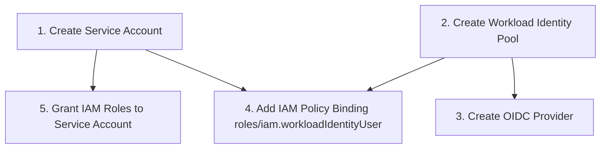
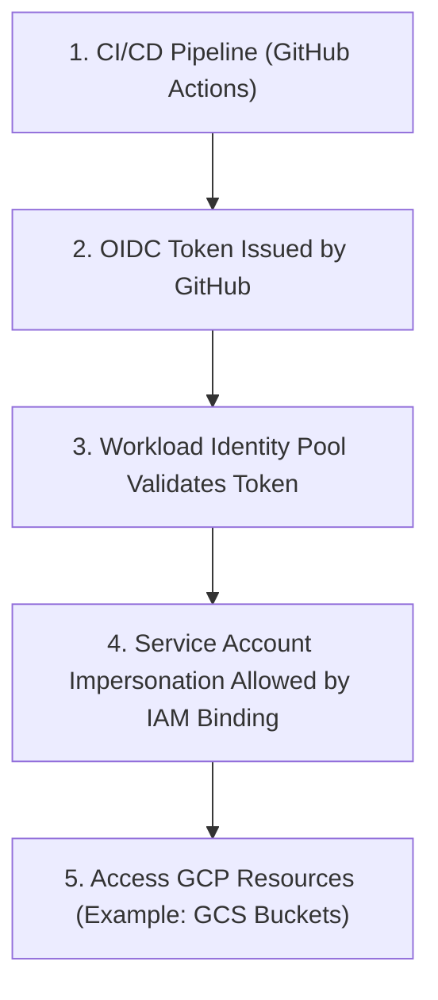

## Setup GCP Service Account

```mermaid
flowchart TD
  SA["1. Create Service Account"]
  WIP["2. Create Workload Identity Pool"]
  OIDCProv["3. Create OIDC Provider"]
  Bind["4. Add IAM Policy Binding roles/iam.workloadIdentityUser"]
  Roles["5. Grant IAM Roles to Service Account"]

  SA --> Roles
  SA --> Bind
  WIP --> OIDCProv
  WIP --> Bind
```

```mermaid
flowchart TD

  CI["1. CI/CD Pipeline (GitHub Actions)"]
  OIDCToken["2. OIDC Token Issued by GitHub"]
  Pool["3. Workload Identity Pool Validates Token"]
  Impersonation["4. Service Account Impersonation Allowed by IAM Binding"]
  Resources["5. Access GCP Resources (Example: GCS Buckets)"]

  CI --> OIDCToken
  OIDCToken --> Pool
  Pool --> Impersonation
  Impersonation --> Resources

```

## Configure Hashicorp Cloud for state management

## Create the Terraform config files

