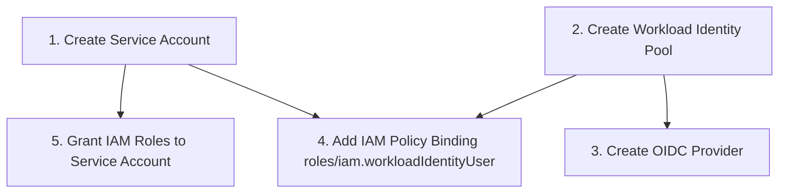
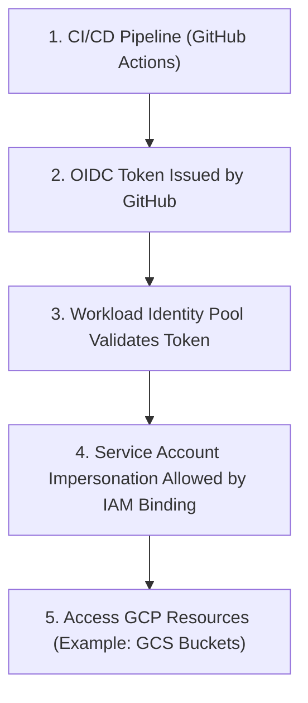

# GCP Infrastructure

## 1. Overview

- Purpose of GCP IaC in this repo
- High-level architecture:
  - Organization / Folders
  - Projects per environment (`dev`, `stg`, `prod`)

## 2. Prerequisites

- GCP Organization / Project owner access
- Terraform Cloud organization & workspaces (see root infra README)
- `gcloud` CLI (for initial setup, if needed)

## 3. Workload Identity Federation (OIDC) Setup: GitHub → GCP

### 3.1 Conceptual Overview

- Why Workload Identity Federation (no long-lived keys)
- Relationship between:
  - Workload Identity Pool
  - Provider (GitHub)
  - Service Account

### 3.2 Create Workload Identity Pool & Provider

- Pool name convention (e.g. `github-pool`)
- Provider config:
  - Issuer URL (GitHub)
  - Attribute mapping (e.g. `assertion.sub`)
  - Attribute conditions (repo, org, branch)

### 3.3 Service Account Setup

- Create GCP service account for Terraform:
  - Suggested name: `terraform-github`
- Grant required IAM roles:
  - `roles/editor` *(or more granular IAM roles)*
  - Project/Folder/Org level as needed
- Bind Workload Identity user role:
  - `roles/iam.workloadIdentityUser` on the service account

### 3.4 GitHub Actions Configuration

- Using `google-github-actions/auth` with `workload_identity_provider` and `service_account`
- Required GitHub `permissions` block (id-token, contents)

## 4. GCP Project & Environment Layout

- Structure:
  - Org → Folder(s) → Projects (dev/stg/prod)
- Naming conventions:
  - `proj-<app>-dev`
  - `proj-<app>-prod`
- Labels:
  - `environment`, `application`, `owner`, `cost_center`

## 5. Terraform Configuration for GCP

### 5.1 Backend & Workspaces

- Terraform Cloud workspace name mapping for GCP
- `backend.tf` example for GCP folder

### 5.2 Providers & Authentication

- `google` and `google-beta` providers
- Project & region settings
- Auth via Workload Identity Federation

### 5.3 Enabling APIs

- List of core APIs (e.g. `compute.googleapis.com`, `iam.googleapis.com`, `cloudresourcemanager.googleapis.com`)
- How/where enabling APIs is handled in Terraform

## 6. Core Modules & Stacks

- `modules/network/`
- `modules/iam/`
- `modules/gke/` or other main components
- `environments/dev/`, `environments/prod/` stacks

Include for each:
- Inputs
- Outputs
- Dependencies

## 7. Running Terraform for GCP

### 7.1 From DevContainer / Locally

- Commands:
  - `terraform init`
  - `terraform plan`
  - `terraform apply`
- Selecting environment (`TF_WORKSPACE`, variables)

### 7.2 From GitHub Actions

- Reusable workflow usage & sample input
- Required secrets:
  - `GCP_PROJECT_ID_DEV`, `GCP_WIF_PROVIDER_DEV`, etc.

## 8. Operational Notes

- How to create a new project/environment with Terraform
- How to extend IAM roles safely
- Troubleshooting WIF / OIDC issues


# Setup GCP Service Account

### 1. Admin Setup (Service Account + WIF + IAM Binding)


### 1.1 Set the Active GCP Project

```bash
gcloud config set project YOUR_PROJECT_ID
```
### 1.2  Create the Terraform Service Account

```bash
gcloud iam service-accounts create terraform-sa \
  --display-name="Terraform Service Account"
```

#### 1.3 Assign IAM Roles to the Service Account

```bash
gcloud projects add-iam-policy-binding YOUR_PROJECT_ID \
  --member="serviceAccount:terraform-sa@YOUR_PROJECT_ID.iam.gserviceaccount.com" \
  --role="roles/storage.admin"
```

###### 1.3.1 Grant read-only access across the project (Optional)

```bash
gcloud projects add-iam-policy-binding YOUR_PROJECT_ID \
  --member="serviceAccount:terraform-sa@YOUR_PROJECT_ID.iam.gserviceaccount.com" \
  --role="roles/viewer"
```

#### 1.4 Create and Download the Service Account JSON Key

```bash
gcloud iam service-accounts keys create terraform-sa-key.json \
  --iam-account="terraform-sa@YOUR_PROJECT_ID.iam.gserviceaccount.com"
```

#### 1.5 Configure Terraform to Use the Service Account

```bash
export GOOGLE_APPLICATION_CREDENTIALS="/absolute/path/to/terraform-sa-key.json"
```

## Future: Move from JSON Keys to Workload Identity Federation (OIDC)

<!-- In the future, to avoid long-lived JSON keys, this setup can be migrated to **Workload Identity Federation (WIF)** / OIDC:

1. **Create a Workload Identity Pool and Provider**  
   - Use `gcloud iam workload-identity-pools create`  
   - Then add a provider (e.g., GitHub Actions, GitLab, or another IdP).

2. **Allow the Pool to Impersonate the Terraform Service Account**  
   - Grant `roles/iam.workloadIdentityUser` on the service account to identities from the pool.

3. **Update Terraform Authentication**  
   - Remove `credentials = file("...")` and JSON keys.  
   - Use application default credentials / OIDC token from your CI (e.g., GitHub Actions) plus:
     ```hcl
     provider "google" {
       project  = "YOUR_PROJECT_ID"
       region   = "us-east4"

       impersonate_service_account = "terraform-sa@YOUR_PROJECT_ID.iam.gserviceaccount.com"
     }
     ```

4. **Delete Old JSON Keys**  
   - Once WIF is working, remove any `terraform-sa` JSON keys:
     ```bash
     gcloud iam service-accounts keys list \
       --iam-account="terraform-sa@YOUR_PROJECT_ID.iam.gserviceaccount.com"

     gcloud iam service-accounts keys delete KEY_ID \
       --iam-account="terraform-sa@YOUR_PROJECT_ID.iam.gserviceaccount.com"
     ``` -->



## Configure Hashicorp Cloud for state management

## Create the Terraform config files

