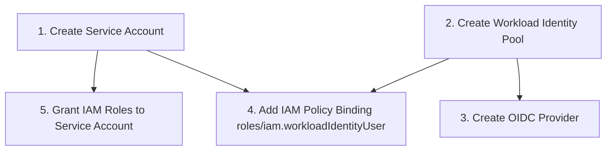
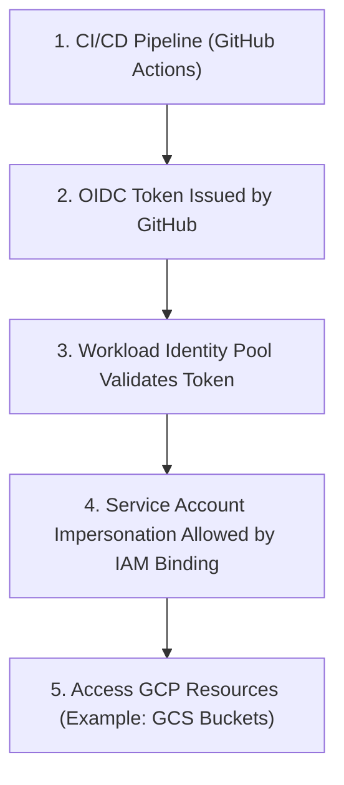

# Setup GCP Service Account

### 1. Admin Setup (Service Account + WIF + IAM Binding)


### 1.1 the Active GCP Project

```bash
gcloud config set project YOUR_PROJECT_ID
```
### 1.2  Create the Terraform Service Account

```bash
gcloud iam service-accounts create terraform-sa \
  --display-name="Terraform Service Account"
```

#### 1.3 Assign IAM Roles to the Service Account

```bash
gcloud projects add-iam-policy-binding YOUR_PROJECT_ID \
  --member="serviceAccount:terraform-sa@YOUR_PROJECT_ID.iam.gserviceaccount.com" \
  --role="roles/storage.admin"
```

###### 1.3.1 Grant read-only access across the project (Optional)

```bash
gcloud projects add-iam-policy-binding YOUR_PROJECT_ID \
  --member="serviceAccount:terraform-sa@YOUR_PROJECT_ID.iam.gserviceaccount.com" \
  --role="roles/viewer"
```

#### 1.4 Create and Download the Service Account JSON Key

```bash
gcloud iam service-accounts keys create terraform-sa-key.json \
  --iam-account="terraform-sa@YOUR_PROJECT_ID.iam.gserviceaccount.com"
```

#### 1.5 Configure Terraform to Use the Service Account

```bash
export GOOGLE_APPLICATION_CREDENTIALS="/absolute/path/to/terraform-sa-key.json"
```

## Future: Move from JSON Keys to Workload Identity Federation (OIDC)

<!-- In the future, to avoid long-lived JSON keys, this setup can be migrated to **Workload Identity Federation (WIF)** / OIDC:

1. **Create a Workload Identity Pool and Provider**  
   - Use `gcloud iam workload-identity-pools create`  
   - Then add a provider (e.g., GitHub Actions, GitLab, or another IdP).

2. **Allow the Pool to Impersonate the Terraform Service Account**  
   - Grant `roles/iam.workloadIdentityUser` on the service account to identities from the pool.

3. **Update Terraform Authentication**  
   - Remove `credentials = file("...")` and JSON keys.  
   - Use application default credentials / OIDC token from your CI (e.g., GitHub Actions) plus:
     ```hcl
     provider "google" {
       project  = "YOUR_PROJECT_ID"
       region   = "us-east4"

       impersonate_service_account = "terraform-sa@YOUR_PROJECT_ID.iam.gserviceaccount.com"
     }
     ```

4. **Delete Old JSON Keys**  
   - Once WIF is working, remove any `terraform-sa` JSON keys:
     ```bash
     gcloud iam service-accounts keys list \
       --iam-account="terraform-sa@YOUR_PROJECT_ID.iam.gserviceaccount.com"

     gcloud iam service-accounts keys delete KEY_ID \
       --iam-account="terraform-sa@YOUR_PROJECT_ID.iam.gserviceaccount.com"
     ``` -->



## Configure Hashicorp Cloud for state management

## Create the Terraform config files

