# GCP Infrastructure

## 1. Overview

- Purpose of GCP IaC in this repo
- High-level architecture:
  - Organization / Folders
  - Projects per environment (`dev`, `stg`, `prod`)

## 2. Prerequisites

- GCP Organization / Project owner access
- Terraform Cloud organization & workspaces (see root infra README)
- `gcloud` CLI (for initial setup, if needed)

## 3. Workload Identity Federation (OIDC) Setup: GitHub → GCP

### 3.1 Conceptual Overview

- Why Workload Identity Federation (no long-lived keys)
- Relationship between:
  - Workload Identity Pool
  - Provider (GitHub)
  - Service Account

### 3.2 Create Workload Identity Pool & Provider

- Pool name convention (e.g. `github-pool`)
- Provider config:
  - Issuer URL (GitHub)
  - Attribute mapping (e.g. `assertion.sub`)
  - Attribute conditions (repo, org, branch)

### 3.3 Service Account Setup

- Create GCP service account for Terraform:
  - Suggested name: `terraform-github`
- Grant required IAM roles:
  - `roles/editor` *(or more granular IAM roles)*
  - Project/Folder/Org level as needed
- Bind Workload Identity user role:
  - `roles/iam.workloadIdentityUser` on the service account

### 3.4 GitHub Actions Configuration

- Using `google-github-actions/auth` with `workload_identity_provider` and `service_account`
- Required GitHub `permissions` block (id-token, contents)

## 4. GCP Project & Environment Layout

- Structure:
  - Org → Folder(s) → Projects (dev/stg/prod)
- Naming conventions:
  - `proj-<app>-dev`
  - `proj-<app>-prod`
- Labels:
  - `environment`, `application`, `owner`, `cost_center`

## 5. Terraform Configuration for GCP

### 5.1 Backend & Workspaces

- Terraform Cloud workspace name mapping for GCP
- `backend.tf` example for GCP folder

### 5.2 Providers & Authentication

- `google` and `google-beta` providers
- Project & region settings
- Auth via Workload Identity Federation

### 5.3 Enabling APIs

- List of core APIs (e.g. `compute.googleapis.com`, `iam.googleapis.com`, `cloudresourcemanager.googleapis.com`)
- How/where enabling APIs is handled in Terraform

## 6. Core Modules & Stacks

- `modules/network/`
- `modules/iam/`
- `modules/gke/` or other main components
- `environments/dev/`, `environments/prod/` stacks

Include for each:
- Inputs
- Outputs
- Dependencies

## 7. Running Terraform for GCP

### 7.1 From DevContainer / Locally

- Commands:
  - `terraform init`
  - `terraform plan`
  - `terraform apply`
- Selecting environment (`TF_WORKSPACE`, variables)

### 7.2 From GitHub Actions

- Reusable workflow usage & sample input
- Required secrets:
  - `GCP_SERVICE_ACCOUNT`, `GCP_WIF_PROVIDER`

### 7.3 Steps to get the GCP_SERVICE_ACCOUNT

> Screenshot showing the Google Cloud Platform service account creation interface with fields for service account name, ID, and description, along with role assignment options for configuring permissions in the IAM and Admin console


### 7.4 Steps to get the GCP_WIF_PROVIDER or Create one (if it does not exist)

### ⚠️  Create a WIF Pool + Provider (GitHub Actions OIDC) so you have a provider 

> #### Step 1 - Validate Auth Login
```bash
gcloud auth login
gcloud config set project <PROJECT_ID>
```

> #### Step 2 - Create a WIF Pool + Provider (GitHub Actions OIDC) so you have a provider
```bash
PROJECT_ID=$(gcloud config get-value project)
PROJECT_NUMBER=$(gcloud projects describe "$PROJECT_ID" --format="value(projectNumber)")

POOL_ID="github-pool"
PROVIDER_ID="github-provider"

gcloud iam workload-identity-pools create "$POOL_ID" \
  --location="global" \
  --display-name="GitHub Actions Pool"
```

> ### Step 3 - Create the provider (OIDC issuer = GitHub)

```bash
gcloud iam workload-identity-pools providers create-oidc "$PROVIDER_ID" \
  --location="global" \
  --workload-identity-pool="$POOL_ID" \
  --display-name="GitHub OIDC Provider" \
  --issuer-uri="https://token.actions.githubusercontent.com" \
  --attribute-mapping="google.subject=assertion.sub,attribute.repository=assertion.repository,attribute.ref=assertion.ref" \
  --attribute-condition="assertion.repository == 'OWNER/REPO'"
```

**Example :**
```bash
gcloud iam workload-identity-pools providers create-oidc "$PROVIDER_ID" \
--location="global" \
--workload-identity-pool="$POOL_ID" \
--display-name="GitHub OIDC Provider" \
--issuer-uri="https://token.actions.githubusercontent.com" \
--attribute-mapping="google.subject=assertion.sub,attribute.repository=assertion.repository,attribute.ref=assertion.ref" \
--attribute-condition="assertion.repository == 'subhamay-bhattacharyya/cloud-resume-challenge'"
```

> ### Step 4 - Create the provider (OIDC issuer = GitHub)

```bash
gcloud iam workload-identity-pools providers describe "$PROVIDER_ID" \
  --location="global" \
  --workload-identity-pool="$POOL_ID" \
  --format="value(name)"

```

### ⚠️  Retrieve the a WIF provider (if you already have one)

> #### Step 1 - Prerequisites

```bash
gcloud auth login
gcloud config set project <PROJECT_ID>
```

> #### Step 2 - List all Workload Identity Pools

```bash
gcloud iam workload-identity-pools list \
  --location="global"
```

> #### Step 3 - List Providers in a Specific Pool

```bash
gcloud iam workload-identity-pools providers list \
  --workload-identity-pool="<POOL_ID>" \
  --location="global"
```

> #### Step 4 - Get Full WIF Provider Resource Name (most commonly needed)

```bash
gcloud iam workload-identity-pools providers describe "<PROVIDER_ID>" \
  --workload-identity-pool="<POOL_ID>" \
  --location="global" \
  --format="value(name)"
```

>> 💡 Example output
```text
projects/123456789012/locations/global/workloadIdentityPools/github-pool/providers/github-provider
```

> #### Step 5 - to grant your GitHub OIDC principal permission to impersonate this service account and mint access tokens

- ### Get the project number (needed for the principalSet string)
```bash
PROJECT_ID="cloud-resume-challenge-06902"
PROJECT_NUMBER=$(gcloud projects describe "$PROJECT_ID" --format="value(projectNumber)")
echo "$PROJECT_NUMBER"
```

- ### Grant required roles on the Service Account 
1. Allow Workload Identity Federation to impersonate the SA
```bash
gcloud iam service-accounts add-iam-policy-binding \
  terraform-sa@cloud-resume-challenge-06902.iam.gserviceaccount.com \
  --project="$PROJECT_ID" \
  --role="roles/iam.workloadIdentityUser" \
  --member="principalSet://iam.googleapis.com/projects/$PROJECT_NUMBER/locations/global/workloadIdentityPools/github-pool/attribute.repository/subhamay-bhattacharyya/cloud-resume-challenge"
```

2. Allow minting access tokens
```bash
gcloud iam service-accounts add-iam-policy-binding \
  terraform-sa@cloud-resume-challenge-06902.iam.gserviceaccount.com \
  --project="$PROJECT_ID" \
  --role="roles/iam.serviceAccountTokenCreator" \
  --member="principalSet://iam.googleapis.com/projects/$PROJECT_NUMBER/locations/global/workloadIdentityPools/github-pool/attribute.repository/subhamay-bhattacharyya/cloud-resume-challenge"

```
- ### Verify the bindings are present
```bash
gcloud iam service-accounts get-iam-policy \
  terraform-sa@cloud-resume-challenge-06902.iam.gserviceaccount.com \
  --project="$PROJECT_ID" \
  --format="yaml"

```
## 8. Operational Notes

- How to create a new project/environment with Terraform
- How to extend IAM roles safely
- Troubleshooting WIF / OIDC issues


# Setup GCP Service Account

### 1. Admin Setup (Service Account + WIF + IAM Binding)


#### 1.1 Authenticate with GCloud CLI

```bash
gcloud auth login
```
#### 1.2 Set the Active GCP Project

```bash
gcloud config set project YOUR_PROJECT_ID
```
### 2  Create the Terraform Service Account

```bash
gcloud iam service-accounts create terraform-sa \
  --display-name="Terraform Service Account"
```

#### 2.1 Assign IAM Roles to the Service Account

```bash
gcloud projects add-iam-policy-binding YOUR_PROJECT_ID \
  --member="serviceAccount:terraform-sa@YOUR_PROJECT_ID.iam.gserviceaccount.com" \
  --role="roles/storage.admin"

  gcloud projects add-iam-policy-binding YOUR_PROJECT_ID \
  --member="serviceAccount:terraform-sa@YOUR_PROJECT_ID.iam.gserviceaccount.com" \
  --role="roles/compute.admin"

  gcloud projects add-iam-policy-binding YOUR_PROJECT_ID \
  --member="serviceAccount:terraform-sa@YOUR_PROJECT_ID.iam.gserviceaccount.com" \
  --role="roles/dns.admin"
```

#### 2.2 Grant read-only access across the project (Optional)

```bash
gcloud projects add-iam-policy-binding YOUR_PROJECT_ID \
  --member="serviceAccount:terraform-sa@YOUR_PROJECT_ID.iam.gserviceaccount.com" \
  --role="roles/viewer"
```

#### 2.3 Create and Download the Service Account JSON Key

```bash
gcloud iam service-accounts keys create terraform-sa-key.json \
  --iam-account="terraform-sa@YOUR_PROJECT_ID.iam.gserviceaccount.com"
```

#### 2.4 Configure Terraform to Use the Service Account

```bash
export GOOGLE_APPLICATION_CREDENTIALS="/absolute/path/to/terraform-sa-key.json"
```

#### 2.5 Enable the following Google Cloud APIs
1. Cloud Resource Manager
2. Compute Engine
3. Cloud Storage
4. Cloud DNS
#### 3 Future: Move from JSON Keys to Workload Identity Federation (OIDC)

<!-- In the future, to avoid long-lived JSON keys, this setup can be migrated to **Workload Identity Federation (WIF)** / OIDC:

1. **Create a Workload Identity Pool and Provider**  
   - Use `gcloud iam workload-identity-pools create`  
   - Then add a provider (e.g., GitHub Actions, GitLab, or another IdP).

2. **Allow the Pool to Impersonate the Terraform Service Account**  
   - Grant `roles/iam.workloadIdentityUser` on the service account to identities from the pool.

3. **Update Terraform Authentication**  
   - Remove `credentials = file("...")` and JSON keys.  
   - Use application default credentials / OIDC token from your CI (e.g., GitHub Actions) plus:
     ```hcl
     provider "google" {
       project  = "YOUR_PROJECT_ID"
       region   = "us-east4"

       impersonate_service_account = "terraform-sa@YOUR_PROJECT_ID.iam.gserviceaccount.com"
     }
     ```

4. **Delete Old JSON Keys**  
   - Once WIF is working, remove any `terraform-sa` JSON keys:
     ```bash
     gcloud iam service-accounts keys list \
       --iam-account="terraform-sa@YOUR_PROJECT_ID.iam.gserviceaccount.com"

     gcloud iam service-accounts keys delete KEY_ID \
       --iam-account="terraform-sa@YOUR_PROJECT_ID.iam.gserviceaccount.com"
     ``` -->


#### 4. Configure Hashicorp Cloud for state management

#### 5. Create the Terraform config files

#### 6. Architecture

```mermaid
flowchart TB
  %% Cloud Resume Challenge (GCP) - Private GCS origin served via HTTPS LB + Cloud CDN

  user((User Browser))

  subgraph dns["DNS (Cloud DNS / Registrar)"]
    a_record["A record: resume.subhamay.com → Global Static IP"]
  end

  subgraph lb["External HTTPS Load Balancer (Global)"]
    ip["Global Static IP"]
    fr["Global Forwarding Rule :443"]
    https_proxy["Target HTTPS Proxy"]
    cert["Google-managed SSL Certificate\n(CN: resume.subhamay.com)"]
    urlmap["URL Map\nRewrite / → /index.html"]
  end

  subgraph cdn["Cloud CDN + Backend Bucket"]
    backend["Backend Bucket\n(enable_cdn=true)"]
    cache["Edge Cache (Cloud CDN)"]
  end

  subgraph gcs["Google Cloud Storage (Origin)"]
    bucket["GCS Bucket\nStatic Website Hosting\n(index.html, 404.html)\nUBLA enabled"]
    objs["Objects\n/index.html\n/404.html"]
  end

  %% Request path
  user -->|"1) Resolve domain"| dns
  dns -->|"A record"| ip

  user -->|"2) HTTPS request"| fr
  fr --> https_proxy
  https_proxy -->|"SNI + TLS"| cert
  https_proxy --> urlmap
  urlmap -->|"3) Route to backend"| backend

  %% CDN behavior
  backend --> cache
  cache -->|"Cache miss → fetch"| bucket
  bucket --> objs
  cache -->|"Cache hit → serve"| user

  %% Direct origin access (blocked/403)
  user -.->|"Direct GCS URL (blocked if private)"| bucket

  %% Notes
  classDef note fill:#f6f6f6,stroke:#999,stroke-width:1px,color:#111;

```



